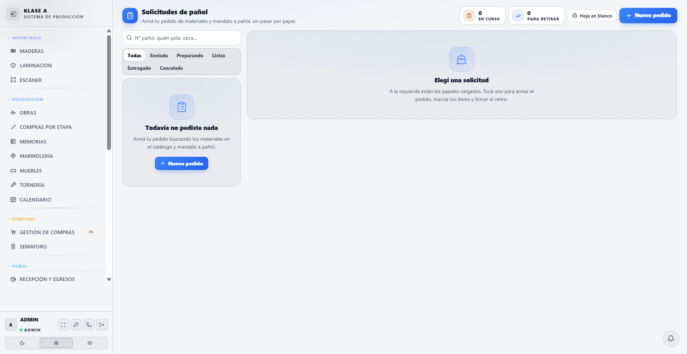
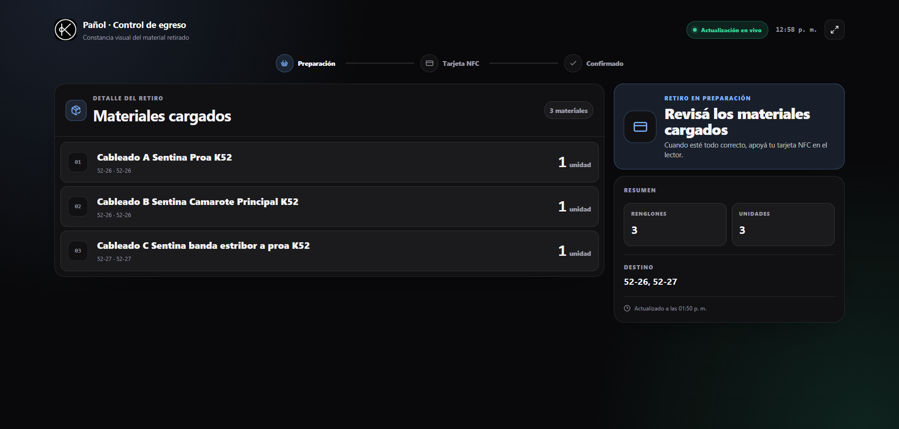
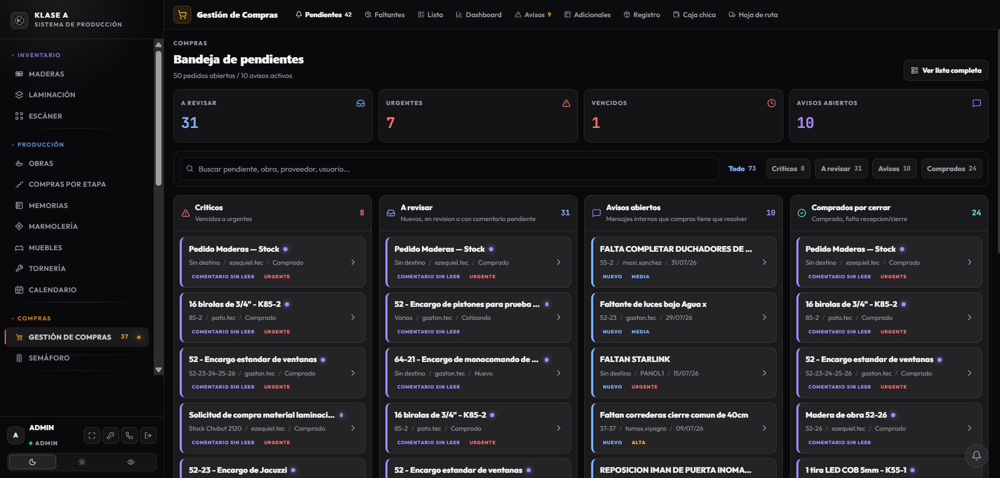
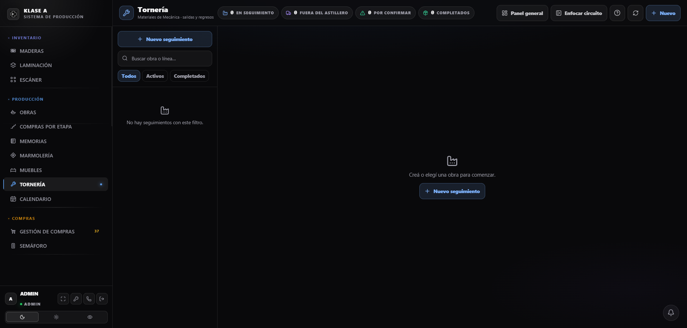
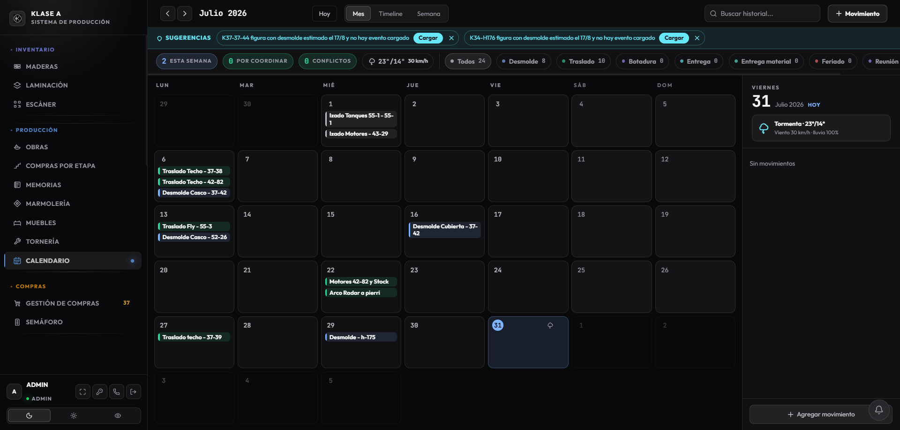

# Informe de trabajo — Sistema de gestión del astillero
## Julio 2026

---

## En pocas palabras

Julio fue el mes en que el sistema dejó de ser un registro de lo que ya pasó y empezó a ser una herramienta de trabajo diario. Se trabajó **23 de los 31 días**, con **14 pantallas nuevas** y **67 cambios en la base de datos**.

El eje del mes fue el **pañol**: se digitalizó el circuito de solicitudes, se cerró el control de quién retira qué con tarjetas por empleado, y se sumó el conteo de consumibles por balanza. Es, de lejos, el área donde más se avanzó.

En paralelo se reordenaron las compras para que se planifiquen desde la fecha de desmolde en vez de a mano, se abrió **tornería** como módulo de seguimiento pieza por pieza, y se empezó a cargar documentación sacándole una foto en lugar de tipearla.

---

## Los números del mes

| | |
|---|---|
| Días trabajados | 23 de 31 |
| Entregas de trabajo | 88 |
| Pantallas nuevas o rehechas | 14 |
| Cambios en la base de datos | 67 |
| Procesos automáticos nuevos | 5 (12 en total) |

---

## Lo más importante

### 1. El pañol dejó de funcionar a ciegas

**El problema.** El pañol movía material todos los días sin dejar rastro utilizable. Las solicitudes eran una hoja A4 que se llenaba a mano y se perdía. Los movimientos de stock quedaban registrados como *"Usuario: sin registrar"*. Y cuando faltaba algo, no había forma de reconstruir quién se lo había llevado.

**Qué se hizo.** Se atacó el circuito completo, no una parte:

- **Las solicitudes se cargan en el sistema** y se imprimen igual, para que quien prefiera el papel lo siga usando. Hay tres formas de que entre una solicitud: la carga el pañol, la carga directamente quien la pide, o **se le saca una foto al papel** y el sistema arma el borrador.
- **Lo que falta cae solo en la bandeja de Compras.** Nadie tiene que avisar.
- **Todo movimiento queda con nombre y apellido.** Se corrigieron los circuitos que dejaban movimientos sin autor: se terminó el "sin registrar".
- **Transferencias reales entre obras y stock**, con posibilidad de anular un movimiento mal cargado en lugar de dejarlo o borrarlo.
- **Conteo físico desde el lector de códigos**, para hacer el relevamiento inicial sin cargar planilla.
- **Varios códigos de barra por material**, porque el mismo producto llega con etiquetas distintas según proveedor o empaque.

**Qué cambia.** El pañol pasa de ser una caja negra a ser el área con mejor trazabilidad del sistema. Cada movimiento tiene autor, fecha y motivo.

*La pantalla de solicitudes de pañol: el circuito digitalizado, sin perder la hoja imprimible para quien la necesite.*

### 2. Quién se lleva qué: tarjetas y la pantalla del mostrador

**El problema.** El retiro de material era el punto ciego. Salía el material y quedaba, en el mejor de los casos, un nombre escrito a mano. No había forma de saber después quién se llevó qué, ni de descontar el stock en el momento.

**Qué se hizo.** Dos piezas que funcionan juntas.

Cada empleado tiene su **tarjeta vinculada a su legajo de RRHH**. Al apoyarla, el sistema lo identifica solo: no hay que buscarlo en una lista ni escribir el nombre. El pañol puede vincular tarjetas pero **no puede crear empleados** — el legajo sigue siendo la única fuente de quién está habilitado.

Y el pañolero trabaja sobre una **pantalla de egresos pensada para el mostrador**, abierta todo el día. Va cargando lo que la persona se lleva y, al confirmar, aparecen en pantalla el **nombre y la foto** de quien retira, queda registrada su **firma**, y el **stock se descuenta en ese mismo momento**.

**Qué cambia.** El retiro pasa de ser un papel a ser un registro con nombre, foto y firma. El stock refleja la realidad al instante en vez de al cierre del día. Y la foto en pantalla evita el error más común del mostrador: que alguien retire a nombre de otro.

*La pantalla de egresos, tomada en vivo: un retiro real esperando que el empleado apoye su tarjeta para confirmar.*

### 3. Las compras se planifican desde el desmolde

**El problema.** Los pedidos se armaban a mano. No había una regla que dijera cuándo hay que pedir cada cosa, así que los atrasos se descubrían tarde, cuando el material ya hacía falta.

**Qué se hizo.** Las compras se separaron de las etapas de producción y pasaron a tener **etapas propias**, que arma el encargado. Cada etapa lleva sus materiales adentro, y su fecha **no se escribe: se calcula** hacia atrás desde el desmolde ("diez semanas antes"). Si el desmolde se corre, todas las fechas se recalculan solas y los atrasos aparecen sin que nadie los busque.

Además: un pedido puede juntar varias etapas, varios proveedores y **varias obras elegidas a mano** — se pide de las obras que uno decide, no de todas. La generación automática de pedidos viene **apagada** y se prende etapa por etapa, para que nada se dispare sin que alguien lo haya decidido. Cada pedido nuevo deja un aviso en la bandeja que Compras ya mira.

**Qué cambia.** En vez de revisar planillas para adivinar qué falta, la pantalla dice qué etapa está atrasada y qué hay que pedir hoy. Cada modificación queda registrada en lenguaje llano: *"Ezequiel cambió Resina epoxi de 100 a 120"*.

*La bandeja que Compras mira todos los días, con los avisos que genera el sistema solo.*

### 4. Tornería: dónde está cada pieza y cuánto tardó

**El problema.** De lo que sale a tornear o plegar no se sabía nada hasta que volvía. Ni dónde estaba, ni cuánto llevaba afuera, ni si había vuelto completo.

**Qué se hizo.** Un módulo nuevo que sigue **cada pieza por separado**: qué salió, a qué taller, en qué viaje, cuándo volvió y qué volvió incompleto. Contempla los casos reales del astillero: piezas que hacen **dos viajes** (salen, vuelven y salen de nuevo), piezas que **se combinan en un conjunto** a mitad del recorrido, y piezas que **arrancan en el proveedor** en vez de en el astillero.

Se le sumó el tramo que más tiempo consume y que antes ni figuraba: **la compra previa del material**. Hoy el recorrido completo va de *Compras → Comprado → Astillero → Taller → Astillero*, y el sistema mide cuánto tardó cada tramo. Cuando Compras o el pañol mueven el pedido, tornería se entera sola: nadie carga el estado dos veces.

**Qué cambia.** El panel muestra la próxima acción concreta: qué retirar, qué reclamar, y qué está trabando a cada barco. Las piezas con **15 días o más afuera** aparecen marcadas.

*El panel de tornería: cada pieza con su recorrido, su taller y sus días afuera.*

### 5. Cargar documentos sin tipear

**El problema.** Cargar comprobantes, remitos y solicitudes a mano se lleva horas y es de donde salen la mayoría de los errores.

**Qué se hizo.** El sistema lee comprobantes y remitos (foto o PDF) y reconoce los materiales aunque el proveedor use abreviaturas distintas a las nuestras. **Recuerda los vínculos ya confirmados**, así no vuelve a preguntar lo mismo. Lo mismo con las solicitudes de pañol en papel: una foto alcanza para dejar un borrador armado, listo para revisar. Las fotos originales quedan siempre guardadas como respaldo.

**Qué cambia.** La carga pasa de *tipear* a *revisar*. La persona confirma lo que el sistema propone en vez de escribirlo desde cero.

---

## El resto, por área

**Producción y fechas.** Se cargaron los plazos productivos por línea y los períodos no laborables por obra, así el sistema sabe cuánto dura realmente cada etapa contando vacaciones y feriados. La grilla de fechas muestra alcance por línea, botadura estimada y atrasos, y permite marcar por barco si un evento ya fue pedido o gestionado.

**Calendario de producción.** Vista de mes con feriados argentinos automáticos. Se preparó además el registro de la **coordinación** de cada evento: un desmolde no es una fecha, es grúa + camión + cuadrilla acordados, y ahora eso deja de vivir suelto en una nota.

*El calendario de producción con los movimientos del mes.*

**Catálogo de materiales.** Es el trabajo menos vistoso del mes y uno de los más necesarios. Se sumó la **matriz de condicionantes** por modelo — un K55 con camarote marinero pide cosas distintas a uno sin él, y ahora eso está modelado en vez de resolverse de memoria. Se agregaron variantes y marcas por ítem, un asistente para resolver duplicados que **recuerda las decisiones tomadas** (si dos materiales no son duplicados, no vuelve a preguntar), exclusiones puntuales por obra, y adicionales vinculados al catálogo real en vez de texto suelto.

**Obras.** Sobre el final del mes se empezó a mover la lista de materiales para que las obras sean la fuente de verdad, con materiales asignados por etapa y por tarea. Es un cambio de fondo, recién arrancado.

**Muebles.** Lotes de producción por juego completo, separados del checklist histórico para no mezclar lo operativo con lo administrativo. La etapa final puede quedar abierta mientras los muebles llegan en entregas parciales. Y cada mueble tiene ahora un **número de pieza fijo** por línea: antes el número era la posición en la lista, así que agregar un mueble corría a todos los demás y el número dejaba de servir para identificarlos en el taller.

**Marmolería.** La pantalla se rehizo como centro de control: bandeja de acciones prioritarias (qué plantillas pedir, qué barcos tienen piezas demoradas, qué volvió incompleto), línea de tiempo desmolde → plantilla → envío → recepción, y vista por barco.

**Personal.** Ausencias programadas — vacaciones, reposos y licencias — combinadas con el presentismo diario, para dejar de cruzar dos planillas a mano. Administración pasó a poder gestionar legajos y presentismo.

**Permisos.** Se afinó quién puede hacer qué, que es lo que permite que el sistema se use sin que todos tengan acceso a todo. Oficina Técnica puede operar stock, recepción y egresos del pañol **sin** volverse gestora de compras; puede crear avisos de envío al pañol sin permiso de recepción; y el rol pañol puede consultar el plano de ubicaciones sin poder editar estanterías.

**Cadete.** Hoja de ruta imprimible con los pedidos del día y registro del gasto contra la caja chica.

---

## Lo que quedó abierto

- **Tornería.** El módulo está terminado y en ajuste fino. Faltan pruebas con obras reales de punta a punta.
- **Coordinación del calendario.** El registro de grúa, camión y cuadrilla está construido y pendiente de habilitar.
- **Lectura de solicitudes por foto.** Funciona y deja un borrador para revisar; está en prueba con solicitudes reales.
- **Portal de proveedores.** Permite que el proveedor responda sin intermediarios. Construido, en validación.
- **Semáforo de producción.** El automatismo está armado y en validación.
- **Obras como fuente de materiales.** Recién empezado sobre el cierre del mes.

---

## Una aclaración necesaria

**Que algo esté construido no significa que se esté usando todos los días.** Este informe sale del registro de trabajo del mes, que muestra con precisión qué se construyó — pero la adopción real en el taller sólo la conoce quien está ahí.

Lo que el registro sí permite afirmar es que el trabajo de julio se concentró en **cerrar circuitos**, no en abrir funciones sueltas: el pañol quedó conectado con compras, compras con producción, y tornería con las dos. Varias de las mejoras del mes salieron de usar los módulos con obras reales y encontrar lo que faltaba.

El próximo paso natural es acompañar la puesta en marcha de lo que ya está construido antes de seguir sumando.

---

*Elaborado a partir del registro completo de trabajo del 1 al 31 de julio de 2026: 88 entregas verificadas en 23 días de trabajo.*
