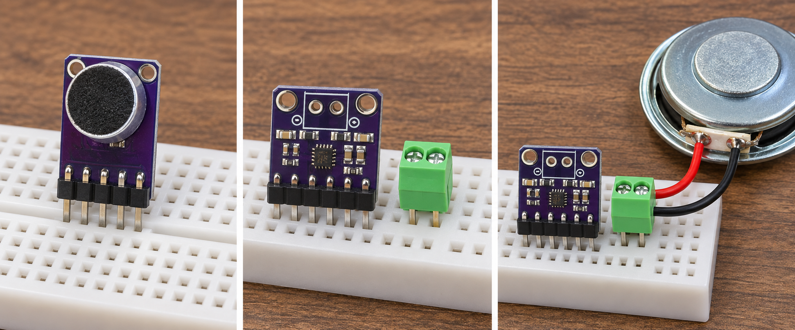
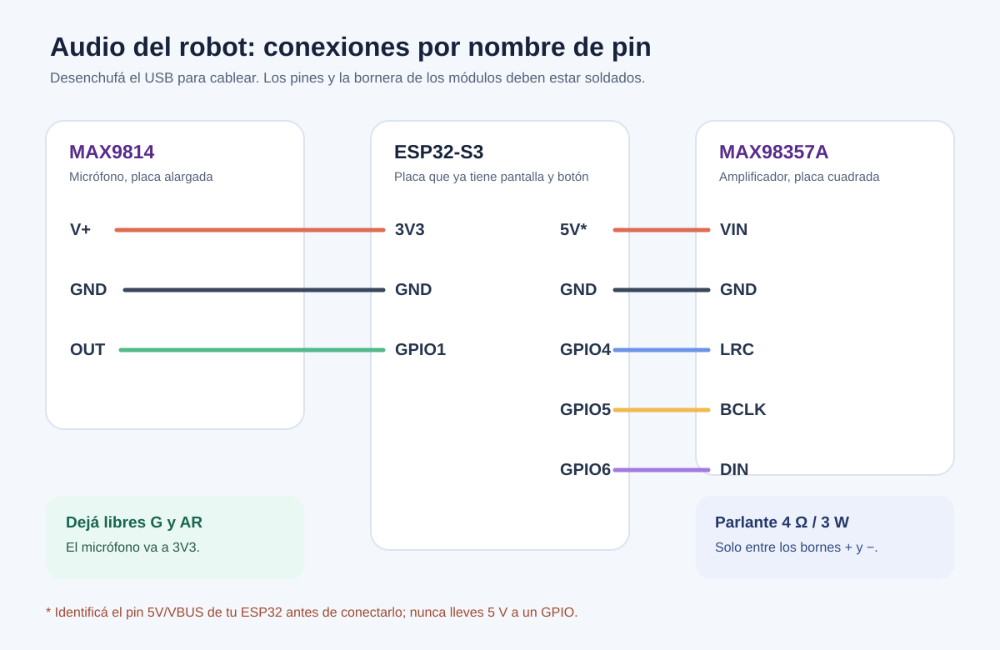

# Audio del robot de pañol: armado inicial

Este tutorial corresponde a la ESP32-S3 N16R8 que ya tiene pantalla ILI9341 y pulsador externo. El audio se puede montar y probar sin resolver todavía el Wi-Fi.

## Láminas visuales del paso a paso

1. [Preparar el soldador y hacer la primera unión](audio-paso-1.png)
2. [Soldar los módulos, la bornera y los cables del parlante](audio-paso-2.png)
3. [Conectar micrófono y amplificador a la ESP32](audio-paso-3.png)

Si nunca soldaste, empezá por dos pines de una tira sobrante. El soldador calienta a la vez el pin y el aro metálico durante aproximadamente 2–3 segundos; el estaño se acerca a esa unión, no directamente a la punta. Retirá primero el estaño, después el soldador y dejá enfriar sin mover. Revisá que no haya un puente entre pines. Todo esto se hace con el USB desenchufado.

La imagen de arriba ilustra el orden del armado. Para contar agujeros y ubicar los contactos usá **tus placas reales**: el MAX9814 tiene 5 pines y el MAX98357A tiene 7. La bornera verde también debe soldarse a los dos agujeros grandes del amplificador; apoyarla suelta como en una ilustración no sirve.

## Qué llegó

- **MAX9814** (placa violeta alargada): micrófono analógico con ganancia automática. Convierte la voz en una señal que lee la ESP32.
- **MAX98357A** (placa violeta cuadrada): recibe audio digital I²S de la ESP32 y alimenta el parlante. No sirve conectar el micrófono directamente a `DIN`.
- **Parlante GM 403W**: marcado 4 Ω / 3 W. Se conecta únicamente a los dos bornes de salida del MAX98357A.
- **Tiras de pines** y **bornera verde**: hay que soldarlas a las placas; apoyarlas sueltas en los agujeros puede dar contacto intermitente.

## Material adicional para el montaje

Soldador de electrónica, estaño, al menos siete cables Dupont hembra-hembra para los pines, dos conductores para el parlante, cortacables/pelacables y, de ser posible, multímetro. Una protoboard ayuda a mantener las placas firmes durante la prueba. Desconectar el USB antes de soldar o mover conexiones.

## Orden de armado

1. **Soldar los pines.** Cortar una tira de 5 para el MAX9814 y una de 7 para el MAX98357A. Insertar los extremos largos en la protoboard, apoyar cada placa sobre los extremos cortos y soldar cada agujero, sin puentear pines adyacentes. Soldar también la bornera verde en los dos agujeros grandes de salida del MAX98357A. La serigrafía `+` y `−` está junto a esa bornera.
2. **Parlante.** Poner un conductor del parlante en `+` y el otro en `−` de la bornera verde. El parlante no va a `GND` de la ESP32 ni a 3V3. Mantener los cables cortos y bien sujetos.
3. **Amplificador.** Con el USB desconectado, unir los pines por **nombre impreso**, no por color de cable:

   | MAX98357A | ESP32-S3 | Función |
   | --- | --- | --- |
   | `VIN` | `5V`/`VBUS` de la placa, **solo si está claramente identificado** | Alimentación del amplificador |
   | `GND` | `GND` | Tierra compartida |
   | `BCLK` | GPIO5 | Reloj I²S |
   | `LRC` | GPIO4 | Selección de canal I²S |
   | `DIN` | GPIO6 | Audio digital enviado por la ESP32 |
   | `GAIN`, `SD` | sin conectar por ahora | Ajustes opcionales |

   **Antes de unir `VIN`**, comprobar la serigrafía del pin de alimentación de la ESP32 y, si hay multímetro, que entregue aproximadamente 5 V cuando está alimentada por USB. No poner 5 V en un GPIO ni en el MAX9814. Si esa identificación no es clara, detener esta conexión y verificarla con una foto nítida de la placa. El amplificador acepta 2,5–5,5 V; a 5 V puede dar cerca de 3 W en 4 Ω, así que usar un cargador de 5 V con al menos 1 A y evitar volumen máximo al principio.
4. **Micrófono.** Conectar `GND` → `GND`, `V+` → `3V3`, `OUT` → GPIO1. Dejar `G`/`GAIN` y `AR` sin conectar inicialmente. La salida del MAX9814 ya tiene una componente continua; va al ADC de GPIO1 sin capacitor en serie para esta prueba.
5. **Revisar antes de enchufar.** La pantalla conserva sus GPIO 8–12 y el botón GPIO7. El micrófono usa GPIO1; el amplificador GPIO4–6. Todas las tierras son comunes. Ningún hilo del parlante toca tierra, alimentación ni otros pines. No hay puntos de soldadura unidos accidentalmente.

## Prueba en dos etapas

1. **Salida:** con el amplificador y el parlante conectados y el cableado revisado, cargar [AudioTest.ino](AudioTest/AudioTest.ino), que emite un tono suave por I²S cada dos segundos. Es una prueba temporal: reemplaza la carita y los avisos hasta recargar el firmware del robot. No cargarla antes de verificar la alimentación `VIN`, tierra y ausencia de puentes. Si no suena, revisar primero `VIN`, `GND`, `BCLK`, `LRC`, `DIN` y la bornera; no subir el volumen para compensar un cable suelto.
2. **Entrada:** conectar el MAX9814 y leer varias muestras del ADC GPIO1. El nivel debe variar al hablar o dar una palmada suave cerca. Si queda fijo, revisar `V+`, `GND` y `OUT`; no conectar `OUT` directamente al amplificador.

Después de esas dos pruebas, se puede incorporar al firmware actual: botón para iniciar una consulta por voz, grabación de unos segundos, respuesta por parlante y texto en pantalla. **Conectar el hardware por sí solo no agrega reconocimiento de voz ni IA**. Esa parte necesita el firmware y la integración de red; seguimos con ella cuando el montaje eléctrico esté comprobado.

## Referencias técnicas

- [MAX9814: alimentación, salida analógica y soldadura](https://learn.adafruit.com/adafruit-agc-electret-microphone-amplifier-max9814?view=all)
- [MAX98357A: alimentación, I²S y salida aislada del parlante](https://learn.adafruit.com/adafruit-max98357-i2s-class-d-mono-amp/pinouts-stereo)
- [GPIO1 como ADC1_CH0 de ESP32-S3](https://docs.espressif.com/projects/esp-hardware-design-guidelines/en/latest/esp32s3/schematic-checklist.html)
- [Interfaz I²S de Arduino-ESP32](https://docs.espressif.com/projects/arduino-esp32/en/latest/api/i2s.html)
